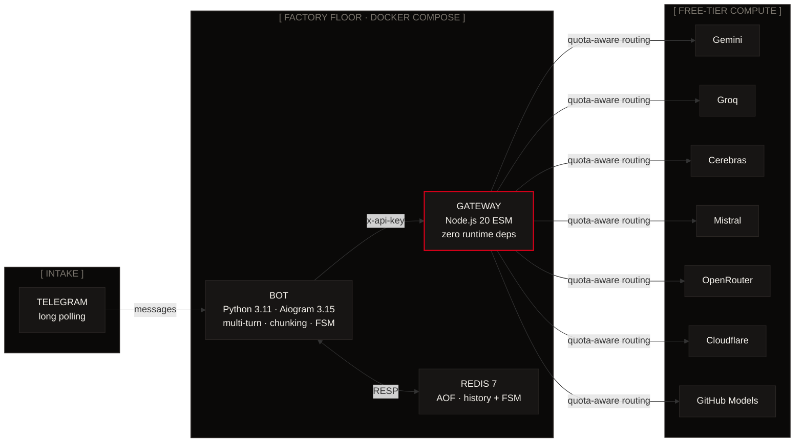
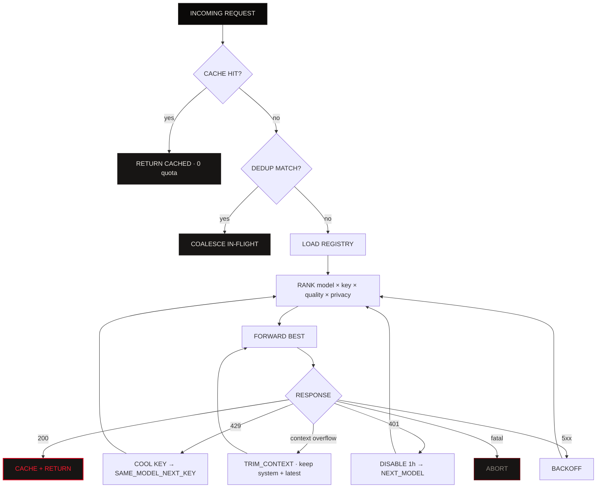
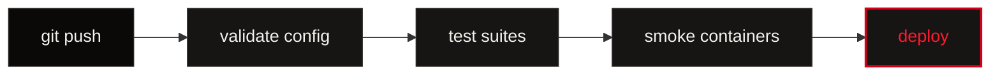

<div align="center">

# KONKRED AI ECOSYSTEM
### controlled enterprise AI workflow hardware · zero-cost by design

[](ci/deploy.yml)
[](docker-compose.yml)
[](LICENSE)
[](gateway/)
[](bot/)
[](docker-compose.yml)
[](render.yaml)

```
ONE ENDPOINT · SEVEN FREE-TIER PROVIDERS · ZERO DOLLARS
```

**Pool Gemini · Groq · Cerebras · Mistral · OpenRouter · Cloudflare Workers AI · GitHub Models**  
behind one OpenAI-compatible rail — quota routing · automatic fallback · response cache · in-flight dedup.

</div>

```
▰▰▰▰▰▰▰▰▰▰▰▰▰▰▰▰▰▰▰▰▰▰▰▰▰▰▰▰▰▰▰▰▰▰▰▰▰▰▰▰▰▰▰▰▰▰▰▰▰▰▰▰▰▰▰▰▰▰▰▰▰▰▰▰
```

## 0 · MANIFEST

| | |
|---|---|
| **WHAT** | Production multi-container AI stack |
| **COST MODEL** | Zero-cost-by-design (free-tier providers + free host path) |
| **SURFACE** | Telegram bot → Gateway → LLM pool |
| **TONE** | Industrial · terse · honest |
| **RED MEANS** | Signal / live / power — not error |
| **RULE** | Background never glows. Only foreground objects ignite. |

```
▰▰▰▰▰▰▰▰▰▰▰▰▰▰▰▰▰▰▰▰▰▰▰▰▰▰▰▰▰▰▰▰▰▰▰▰▰▰▰▰▰▰▰▰▰▰▰▰▰▰▰▰▰▰▰▰▰▰▰▰▰▰▰▰
```

## I · HARDWARE BENCH TOPOLOGY



### Service breakdown

| ID | Bench | Stack | Assignment |
|:---:|:---|:---|:---|
| `GW-01` | **gateway** | Node.js 20 · ESM · *zero runtime deps* | Quota-aware reverse proxy. Pools 7 free-tier LLM APIs behind one OpenAI-ish endpoint. Sliding-window limits, per-error-class fallback, response cache, in-flight dedup. |
| `BOT-02` | **bot** | Python 3.11 · Aiogram 3.15 · httpx · redis | Telegram front-end. Multi-turn memory in Redis, task modes, non-blocking typing indicators, Telegram-safe 4096-char chunking, resilient gateway client. |
| `RD-03` | **redis** | Redis 7 · AOF | Conversation history + Aiogram FSM storage. History keys expire after 24h. |

```
▰▰▰▰▰▰▰▰▰▰▰▰▰▰▰▰▰▰▰▰▰▰▰▰▰▰▰▰▰▰▰▰▰▰▰▰▰▰▰▰▰▰▰▰▰▰▰▰▰▰▰▰▰▰▰▰▰▰▰▰▰▰▰▰
```

## II · REQUEST LIFECYCLE

```mermaid
sequenceDiagram
    autonumber
    actor U as USER
    participant TG as TELEGRAM
    participant B as BOT
    participant R as REDIS
    participant G as GATEWAY
    participant L as LLM POOL

    U->>TG: message
    TG->>B: long-poll update
    B->>R: load history + FSM
    R-->>B: state
    B->>G: POST /api/ai (x-api-key)

    rect rgb(23,21,20)
        Note over G,L: ROUTING ENGINE
        G->>G: cache + dedup check
        G->>G: rank model × key × quality × privacy
        G->>L: forward best candidate
        L-->>G: 200 or classified error
        G->>G: update sliding windows
    end

    G-->>B: ok + content + provider + model
    B->>R: persist turn (24h TTL)
    B->>TG: chunked reply ≤4096
    TG-->>U: reply + provider footer stamp
```



```
▰▰▰▰▰▰▰▰▰▰▰▰▰▰▰▰▰▰▰▰▰▰▰▰▰▰▰▰▰▰▰▰▰▰▰▰▰▰▰▰▰▰▰▰▰▰▰▰▰▰▰▰▰▰▰▰▰▰▰▰▰▰▰▰
```

## III · IGNITION · QUICKSTART

### Local / VPS

```bash
git clone https://github.com/reARbitRA/konkred-AI-ecosystem.git
cd konkred-AI-ecosystem

./setup.sh                 # .env → validate → build → start → health-check
nano .env                  # TELEGRAM_BOT_TOKEN + ≥1 provider key
docker compose up -d
docker compose logs -f bot
```

> [!TIP]
> **No keys?** Offline simulator:
> ```bash
> ./setup.sh --mock
> curl -s localhost:3000/api/health | jq .
> ```

<details>
<summary><b>[ CLI MANIFOLD ]</b></summary>

| Command | Function |
|:---|:---|
| `./setup.sh` | Full bootstrap |
| `./setup.sh --mock` | Mock provider (no API keys) |
| `./setup.sh --check` | Static validation only (no Docker) |
| `./setup.sh --logs` | Tail all services |
| `./setup.sh --down` | Stop (keeps Redis volume) |
| `./scripts/verify.sh` | Full suite (same as CI) |

</details>

> [!NOTE]
> Telegram → `/start` → pick task → ask.  
> Replies stamp provider/model by default. Disable with `SHOW_PROVIDER_FOOTER=false`.

```
▰▰▰▰▰▰▰▰▰▰▰▰▰▰▰▰▰▰▰▰▰▰▰▰▰▰▰▰▰▰▰▰▰▰▰▰▰▰▰▰▰▰▰▰▰▰▰▰▰▰▰▰▰▰▰▰▰▰▰▰▰▰▰▰
```

## IV · GATEWAY API

Unified envelope:

```json
{ "ok": true,  "data":  { } }
{ "ok": false, "error": { "code": "...", "message": "..." } }
```

Rate-limits include `Retry-After` (bot honours it).

### Endpoint map

| Method | Path | Auth | Purpose |
|:---:|:---|:---:|:---|
| `POST` | `/api/ai` | `x-api-key` | Inference · quota-aware routing |
| `GET` | `/api/health` | — | Liveness + pool summary |
| `GET` | `/api/ready` | — | Readiness · `503` when all keys cooling |
| `GET` | `/api/models` | `x-api-key` | Registry + availability |
| `GET` | `/api/status` | `x-admin-key` | Deep status (pool, cache, callers) |
| `POST` | `/api/admin/cache/flush` | `x-admin-key` | Flush response cache |
| `GET` | `/` | — | HTML status dashboard |

<details>
<summary><b>[ POST /api/ai · FULL SCHEMA ]</b></summary>

```json
{
  "taskType": "code-generation",
  "messages": [{ "role": "user", "content": "Write a chunker in Python" }],
  "maxTokens": 2048,
  "temperature": 0.3,
  "privacy": "private",
  "skipCache": false,
  "model": "groq:gpt-oss-120b"
}
```

| Field | Notes |
|:---|:---|
| `taskType` | `general` · `code-generation` · `bug-fixing` · `architecture` · `summarization` · `translate` · `extraction` |
| `messages` | OpenAI-style `[{role, content}]` · bare `prompt` also accepted |
| `privacy` | `private` → only providers that do **not** train on your data |
| `model` | Optional preference · ranked first when capacity exists |
| `maxTokens` | Response ceiling |
| `temperature` | Sampling temperature |
| `skipCache` | Bypass memory cache |

**`data` returns:** `content`, `provider`, `model`, `modelId`, `usage`, `cached`, `attemptCount`, `attempts[]` (fallback trace).

</details>

<details>
<summary><b>[ ERROR CODES · STAMPED ]</b></summary>

| Code | HTTP | Meaning |
|:---|:---:|:---|
| `MISSING_API_KEY` | 401 | No `x-api-key` |
| `INVALID_API_KEY` | 403 | Key not in registry |
| `UNKNOWN_TASK_TYPE` | 400 | Bad `taskType` |
| `MISSING_MESSAGES` | 400 | No `messages` / `prompt` |
| `USER_RPM` / `USER_RPD` / `USER_TPD` | 429 | Caller quota · + `Retry-After` |
| `CAPACITY_EXHAUSTED` | 503 | All keys cooling |
| `NO_PROVIDER_CREDENTIALS` | 503 | No upstream keys |
| `PAYLOAD_TOO_LARGE` | 413 | Body too large |

</details>

```
▰▰▰▰▰▰▰▰▰▰▰▰▰▰▰▰▰▰▰▰▰▰▰▰▰▰▰▰▰▰▰▰▰▰▰▰▰▰▰▰▰▰▰▰▰▰▰▰▰▰▰▰▰▰▰▰▰▰▰▰▰▰▰▰
```

## V · QUOTA-AWARE ROUTING ENGINE



### Pipeline

| Step | Component | Behaviour |
|:---:|:---|:---|
| 1 | **Registry** | `gateway/data/policies.registry.json` — reset policy (`utc-midnight` / `pt-midnight`), training flags, learned-limit headers, per-model `rpm` `rpd` `tpm` `tpd` `monthlyTokens` `contextWindow` `quality` |
| 2 | **Key pool** | Sliding 60s RPM/TPM + day/month counters. Cool on 429. Disable 1h on auth fail. Learn real limits from provider headers. |
| 3 | **Router** | Rank by task fit, quality, privacy, remaining capacity. Interleave vendors so one saturated provider cannot burn every attempt. |
| 4 | **Fallback** | `SAME_MODEL_NEXT_KEY` · `NEXT_MODEL` · `TRIM_CONTEXT` · `BACKOFF` · `ABORT` (`gateway/src/gateway/fallback.mjs`). Context errors preserve system prompt + newest turn. |
| 5 | **Cache + dedup** | TTL memory cache. Identical in-flight requests share one upstream call (one quota unit). |
| 6 | **Watchdog** | Prune windows, sweep cache, log saturation every 60s. |

```
▰▰▰▰▰▰▰▰▰▰▰▰▰▰▰▰▰▰▰▰▰▰▰▰▰▰▰▰▰▰▰▰▰▰▰▰▰▰▰▰▰▰▰▰▰▰▰▰▰▰▰▰▰▰▰▰▰▰▰▰▰▰▰▰
```

## VI · CONFIGURATION

`./setup.sh` copies `.env.example` → `.env`.  
Full template: [`.env.example`](.env.example)  
CI guard: `scripts/validate_env.py` fails if code and template drift.

### Minimum viable `.env`

```env
TELEGRAM_BOT_TOKEN=123456789:AA...          # @BotFather
ADMIN_KEY=                                  # openssl rand -hex 32 (auto by setup.sh)
USERS_JSON=[{"key":"bot-internal-key","userId":"telegram-bot","tier":"internal"}]
GATEWAY_API_KEY=bot-internal-key
GROQ_API_KEY=gsk_...                        # any ONE provider key is enough
```

Optional: `ALLOWED_USER_IDS=111111,222222` (empty = open).

> [!IMPORTANT]
> `.env` is git-ignored and created mode `600`. **Never commit keys.**

```
▰▰▰▰▰▰▰▰▰▰▰▰▰▰▰▰▰▰▰▰▰▰▰▰▰▰▰▰▰▰▰▰▰▰▰▰▰▰▰▰▰▰▰▰▰▰▰▰▰▰▰▰▰▰▰▰▰▰▰▰▰▰▰▰
```

## VII · PROJECT LAYOUT

```text
.
├── docker-compose.yml
├── .env.example
├── render.yaml
├── setup.sh
├── ci/deploy.yml
├── LICENSE
├── .github/workflows/deploy.yml
├── scripts/
│   ├── verify.sh
│   ├── validate_compose.py
│   ├── validate_env.py
│   ├── check_python_imports.py
│   ├── install-workflow.sh
│   └── integration_bot_gateway.py
├── Makefile
├── gateway/
│   ├── Dockerfile  package.json
│   ├── data/policies.registry.json
│   ├── scripts/{check,smoke}.mjs
│   ├── tests/gateway.test.mjs
│   └── src/
│       ├── server.mjs  config.mjs  util.mjs  policy-store.mjs
│       ├── watchdog.mjs  dashboard.mjs  fullkonk.mjs  openai-shim.mjs
│       ├── providers/{base,openai-compat,gemini,cloudflare,mock,index}.mjs
│       └── gateway/{gateway,router,key-pool,user-limiter,fallback,cache,dedup,fusion}.mjs
├── bot/
│   ├── Dockerfile  requirements.txt  healthcheck.py
│   ├── config.py  main.py  handlers.py  gateway_client.py
│   ├── history.py  keyboards.py  chunking.py
│   └── tests/{test_chunking,test_gateway_client,test_history,test_handlers}.py
├── Konkred ecosystem.md
└── step-by-step.md
```

```
▰▰▰▰▰▰▰▰▰▰▰▰▰▰▰▰▰▰▰▰▰▰▰▰▰▰▰▰▰▰▰▰▰▰▰▰▰▰▰▰▰▰▰▰▰▰▰▰▰▰▰▰▰▰▰▰▰▰▰▰▰▰▰▰
```

## VIII · DIAGNOSTICS

```bash
./scripts/verify.sh
cd gateway && node --test tests/*.test.mjs
cd gateway && node scripts/smoke.mjs
cd bot && PYTHONPATH=tests:. python -m unittest discover -s tests -p 'test_*.py' -t .
python scripts/integration_bot_gateway.py
```

| Suite | Yield | Command |
|:---|:---:|:---|
| Gateway unit | **31** | `node --test tests/*.test.mjs` |
| Gateway smoke | **21** | `node scripts/smoke.mjs` |
| Bot unit | **88** | `python -m unittest discover -s tests` |
| Integration E2E | **8** | `python scripts/integration_bot_gateway.py` |
| **Total** | **148** | `./scripts/verify.sh` |

<details>
<summary><b>[ COVERAGE STAMPS ]</b></summary>

- Sliding-window ceilings and cooldowns  
- Fallback decisions for every error class  
- Context trimming (system prompt + newest turn preserved)  
- Cache TTL / dedup coalescing  
- Caller quotas (RPM / RPD / TPD)  
- UTF-16-aware chunking (emoji, code fences, no-boundary walls, infinite-loop regressions)  
- Gateway cold starts  
- `Retry-After` (seconds + HTTP-date)  
- 503/504 retries  
- Malformed 200s  
- Redis outages and corrupt payloads  

</details>

```
▰▰▰▰▰▰▰▰▰▰▰▰▰▰▰▰▰▰▰▰▰▰▰▰▰▰▰▰▰▰▰▰▰▰▰▰▰▰▰▰▰▰▰▰▰▰▰▰▰▰▰▰▰▰▰▰▰▰▰▰▰▰▰▰
```

## IX · DEPLOYMENT

Full guide: **[DEPLOYMENT.md](DEPLOYMENT.md)**

| Platform | Cost | Notes |
|:---|:---:|:---|
| Docker Compose on VPS | **$0** | Oracle Always-Free ARM · true 24/7 |
| Render | Low | 1-click · [`render.yaml`](render.yaml) |
| Koyeb | Low | CLI |
| Fly.io | Low | Edge |
| Upstash Redis | Free tier | Managed add-on |

> [!IMPORTANT]
> **24/7 free path:** Telegram needs an always-on worker. Render free web sleeps; free background workers do not exist. Fully free = Docker Compose on a $0 VM (Oracle Always-Free, etc.).

```
▰▰▰▰▰▰▰▰▰▰▰▰▰▰▰▰▰▰▰▰▰▰▰▰▰▰▰▰▰▰▰▰▰▰▰▰▰▰▰▰▰▰▰▰▰▰▰▰▰▰▰▰▰▰▰▰▰▰▰▰▰▰▰▰
```

## X · OPERATIONAL NOTES

| Topic | Detail |
|:---|:---|
| Cold starts | Bot waits for `GET /api/health`; connect errors retry with backoff |
| Secrets | `.env` gitignored · mode `600` · never commit keys |
| State | Redis AOF on named volume · history TTL 24h |
| Footer stamp | Provider/model on every reply · `SHOW_PROVIDER_FOOTER=false` to hide |

```
▰▰▰▰▰▰▰▰▰▰▰▰▰▰▰▰▰▰▰▰▰▰▰▰▰▰▰▰▰▰▰▰▰▰▰▰▰▰▰▰▰▰▰▰▰▰▰▰▰▰▰▰▰▰▰▰▰▰▰▰▰▰▰▰
```

## XI · CI PIPELINE

> [!WARNING]
> GitHub only runs workflows from `.github/workflows/` (needs `workflows` scope). Enable once:

```bash
./scripts/install-workflow.sh
git add .github/workflows/deploy.yml
git commit -m "ci: enable pipeline"
git push
```



```
▰▰▰▰▰▰▰▰▰▰▰▰▰▰▰▰▰▰▰▰▰▰▰▰▰▰▰▰▰▰▰▰▰▰▰▰▰▰▰▰▰▰▰▰▰▰▰▰▰▰▰▰▰▰▰▰▰▰▰▰▰▰▰▰
```

<div align="center">

## LICENSE
**MIT** — see headers in each source file.

```
[ END OF MANIFEST ]
```

[⬆ top](#konkred-ai-ecosystem)

</div>
