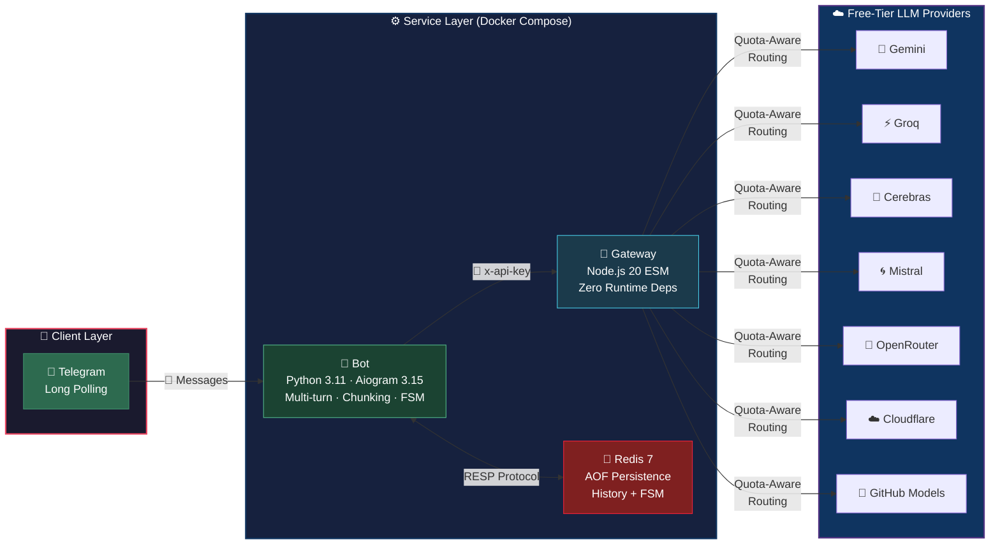
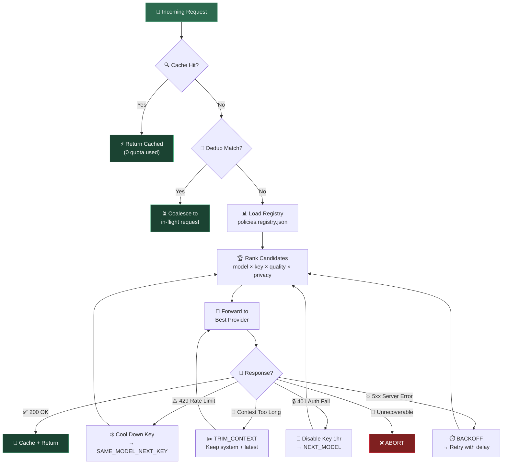

```markdown
<div align="center">

# 🧠 Konkred AI Ecosystem

### *A production-ready, **zero-cost-by-design** multi-container AI stack*

[](ci/deploy.yml)
[](docker-compose.yml)
[](LICENSE)
[](gateway/)
[](bot/)
[](docker-compose.yml)
[](render.yaml)

---

> **One endpoint. Seven free-tier LLM providers. Zero dollars.**
> Pool Gemini, Groq, Cerebras, Mistral, OpenRouter, Cloudflare Workers AI & GitHub Models behind a single OpenAI-compatible API — with smart quota routing, automatic fallback, response caching, and in-flight deduplication.

</div>

---

## 🏗️ System Architecture



---

## 🧩 Service Breakdown

| | Service | Stack | Role |
|:---:|:---|:---|:---|
| 🚀 | **Gateway** | `Node.js 20` · ESM · *Zero runtime deps* | Quota-aware reverse proxy pooling **7 free-tier LLM APIs** behind one OpenAI-ish endpoint — sliding-window rate limits, per-error-class fallback, response caching & in-flight dedup |
| 🤖 | **Bot** | `Python 3.11` · Aiogram 3.15 · httpx · redis | Telegram front-end — multi-turn memory in Redis, task modes, non-blocking typing indicators, Telegram-safe 4096-char chunking, resilient gateway client |
| 💾 | **Redis** | `Redis 7` · AOF | Conversation history + Aiogram FSM storage with 24h TTL expiry |

---

## 🔄 Request Lifecycle

```mermaid
sequenceDiagram
    autonumber
    actor User as 👤 User
    participant TG as 📱 Telegram
    participant Bot as 🐍 Bot
    participant RD as 💾 Redis
    participant GW as 🚀 Gateway
    participant LLM as ☁️ LLM Pool

    User->>TG: Sends message
    TG->>Bot: Long-poll update
    Bot->>RD: Load conversation history
    RD-->>Bot: Return history + FSM state
    Bot->>GW: POST /api/ai (x-api-key)
    
    rect rgb(30, 60, 90)
        Note over GW,LLM: 🧠 Smart Routing
        GW->>GW: Check cache & dedup
        GW->>GW: Rank providers by quota + quality
        GW->>LLM: Forward to best available
        LLM-->>GW: Response (or 429 → fallback)
        GW->>GW: Update sliding windows
    end
    
    GW-->>Bot: { ok: true, data: { content, provider, model } }
    Bot->>RD: Save turn to history
    Bot->>TG: Send chunked reply (≤4096 chars)
    TG-->>User: 📨 Response + provider footer
```



---

## ⚡ Quickstart

### 🖥️ Local / VPS (3 steps)

```bash
# 1️⃣  Clone & enter
git clone https://github.com/reARbitRA/konkred-AI-ecosystem.git
cd konkred-AI-ecosystem

# 2️⃣  Bootstrap (creates .env, validates, builds, starts, health-checks)
./setup.sh

# 3️⃣  Add your secrets & restart
nano .env                  # ← TELEGRAM_BOT_TOKEN + at least ONE provider key
docker compose up -d
docker compose logs -f bot
```

> [!TIP]
> 🎮 **Want to try it without ANY API keys?** Run the offline simulator:
> ```bash
> ./setup.sh --mock          # DEMO_MOCK=true → gateway answers via mock provider
> curl -s localhost:3000/api/health | jq .
> ```

<details>
<summary>📋 <b>All CLI Commands</b> (click to expand)</summary>

| Command | Description |
|:---|:---|
| `./setup.sh` | Full bootstrap: env → validate → build → start → health-check |
| `./setup.sh --mock` | Start with mock LLM provider (no keys needed) |
| `./setup.sh --check` | Static validation only (no Docker required) |
| `./setup.sh --logs` | Tail all service logs |
| `./setup.sh --down` | Stop services (keeps Redis volume) |
| `./scripts/verify.sh` | Full test/verification suite (same as CI) |

</details>

> [!NOTE]
> Open Telegram → message your bot → `/start` → pick a task → ask anything.
> Every reply is footered with the provider/model that served it. Set `SHOW_PROVIDER_FOOTER=false` to disable.

---

## 🌐 Gateway API Reference

All responses use a unified envelope:

```json
// ✅ Success
{ "ok": true, "data": { ... } }

// ❌ Error
{ "ok": false, "error": { "code": "...", "message": "..." } }
```

> Rate-limit responses include a `Retry-After` header the bot automatically honours.

### 📡 Endpoint Map

| Method | Path | 🔐 Auth | Purpose |
|:---:|:---|:---:|:---|
| `POST` | `/api/ai` | `x-api-key` | 🧠 Inference with quota-aware routing |
| `GET` | `/api/health` | — | 💚 Liveness + pool summary |
| `GET` | `/api/ready` | — | ✅ Readiness (`503` when all keys cooling) |
| `GET` | `/api/models` | `x-api-key` | 📋 Registry listing + availability flags |
| `GET` | `/api/status` | `x-admin-key` | 🔍 Deep JSON status (pool, cache, callers) |
| `POST` | `/api/admin/cache/flush` | `x-admin-key` | 🗑️ Drop the response cache |
| `GET` | `/` | — | 📊 HTML status dashboard |

<details>
<summary>📝 <b>POST /api/ai — Full Request Schema</b> (click to expand)</summary>

```json
{
  "taskType": "code-generation",
  "messages": [
    { "role": "user", "content": "Write a chunker in Python" }
  ],
  "maxTokens": 2048,
  "temperature": 0.3,
  "privacy": "private",
  "skipCache": false,
  "model": "groq:gpt-oss-120b"
}
```

| Field | Type | Description |
|:---|:---:|:---|
| `taskType` | `string` | `general` · `code-generation` · `bug-fixing` · `architecture` · `summarization` · `translate` · `extraction` |
| `messages` | `array` | OpenAI-style `[{role, content}]`; bare `prompt` string also accepted |
| `privacy` | `string` | `private` → routes **only** to providers that do **not** train on your data |
| `model` | `string` | Optional preference — ranked first when capacity available |
| `maxTokens` | `int` | Token ceiling for the response |
| `temperature` | `float` | Sampling temperature |
| `skipCache` | `bool` | Bypass the response cache |

**Response `data`** includes: `content`, `provider`, `model`, `modelId`, `usage`, `cached`, `attemptCount`, and a per-attempt `attempts[]` trace for debugging fallback behaviour.

</details>

<details>
<summary>🚨 <b>Error Codes Reference</b> (click to expand)</summary>

| Code | HTTP | Meaning |
|:---|:---:|:---|
| `MISSING_API_KEY` | 401 | No `x-api-key` header |
| `INVALID_API_KEY` | 403 | Key not in user registry |
| `UNKNOWN_TASK_TYPE` | 400 | Invalid `taskType` value |
| `MISSING_MESSAGES` | 400 | No `messages` or `prompt` |
| `USER_RPM` / `USER_RPD` / `USER_TPD` | 429 | Caller quota exceeded (+ `Retry-After`) |
| `CAPACITY_EXHAUSTED` | 503 | All provider keys cooling |
| `NO_PROVIDER_CREDENTIALS` | 503 | No upstream keys configured |
| `PAYLOAD_TOO_LARGE` | 413 | Request exceeds size limit |

</details>

---

## 🧭 How Quota-Aware Routing Works



<details>
<summary>📖 <b>Detailed Routing Pipeline</b> (click to expand)</summary>

| Step | Component | What It Does |
|:---:|:---|:---|
| **1** | 📋 **Registry** | `gateway/data/policies.registry.json` declares each provider's reset policy (`utc-midnight` / `pt-midnight` for Gemini), data-training flags, header names for learned limits, and per-model `rpm`/`rpd`/`tpm`/`tpd`/`monthlyTokens`/`contextWindow`/`quality` |
| **2** | 🔑 **Key Pool** | Sliding 60s windows for RPM/TPM + calendar-day/month counters per key. Keys cool after 429, disable 1hr after auth failure, and *learn* real limits from provider response headers |
| **3** | 🏆 **Router** | Ranks `{model, key}` candidates by task preference, quality fit, privacy & remaining capacity; interleaves providers so one saturated vendor can't burn every attempt |
| **4** | 🔀 **Fallback** | Each upstream error classified → `SAME_MODEL_NEXT_KEY` · `NEXT_MODEL` · `TRIM_CONTEXT` · `BACKOFF` · `ABORT` (see `gateway/src/gateway/fallback.mjs`). Context errors shrink history while preserving system prompt + newest turn |
| **5** | 💾 **Cache + Dedup** | Identical prompts within TTL answered from memory; concurrent identical requests share a single upstream attempt (one quota unit) |
| **6** | 🐕 **Watchdog** | Prunes expired windows, sweeps cache, logs pool saturation every 60 seconds |

</details>

---

## ⚙️ Configuration

> Copy `.env.example` → `.env` (done automatically by `setup.sh`).
> Full documented template: [`.env.example`](.env.example)
> CI guard: `scripts/validate_env.py` fails the pipeline if code and template drift.

### 🔑 Minimum Viable `.env`

```env
TELEGRAM_BOT_TOKEN=123456789:AA...          # @BotFather
ADMIN_KEY=$(openssl rand -hex 32)            # generated by setup.sh
USERS_JSON=[{"key":"bot-internal-key","userId":"telegram-bot","tier":"internal"}]
GATEWAY_API_KEY=bot-internal-key
GROQ_API_KEY=gsk_...                          # any ONE provider key is enough
```

> [!TIP]
> 🔒 **Optional allow-list:** `ALLOWED_USER_IDS=111111,222222` restricts the bot to specific Telegram accounts. Leave empty = open to everyone.

---

## 📁 Project Structure

```mermaid
graph TD
    ROOT["📦 konkred-AI-ecosystem"] --> DC["🐳 docker-compose.yml"]
    ROOT --> ENV["🔐 .env.example"]
    ROOT --> RENDER["☁️ render.yaml"]
    ROOT --> SETUP["🛠️ setup.sh"]
    ROOT --> CI["🔄 ci/deploy.yml"]
    ROOT --> LIC["📜 LICENSE"]

    ROOT --> GW_DIR["🚀 gateway/"]
    GW_DIR --> GW_SRC["src/"]
    GW_SRC --> GW_SRV["server.mjs · config.mjs"]
    GW_SRC --> GW_GW["gateway/ (router · key-pool · fallback · cache · dedup)"]
    GW_SRC --> GW_PRV["providers/ (gemini · openai-compat · cloudflare · mock)"]
    GW_DIR --> GW_DATA["data/policies.registry.json"]
    GW_DIR --> GW_TEST["tests/ · scripts/"]

    ROOT --> BOT_DIR["🤖 bot/"]
    BOT_DIR --> BOT_SRC["main.py · handlers.py · gateway_client.py"]
    BOT_DIR --> BOT_UTL["history.py · keyboards.py · chunking.py"]
    BOT_DIR --> BOT_TST["tests/ (88 tests)"]

    ROOT --> SCR_DIR["📜 scripts/"]
    SCR_DIR --> SCR_VFY["verify.sh"]
    SCR_DIR --> SCR_VAL["validate_compose.py · validate_env.py"]
    SCR_DIR --> SCR_INT["integration_bot_gateway.py"]

    style ROOT fill:#1a1a2e,stroke:#e94560,stroke-width:3px,color:#fff
    style GW_DIR fill:#1b3a4b,stroke:#48cae4,stroke-width:2px,color:#fff
    style BOT_DIR fill:#1b4332,stroke:#52b788,stroke-width:2px,color:#fff
    style SCR_DIR fill:#3d2c5e,stroke:#9b5de5,stroke-width:2px,color:#fff
```



---

## 🧪 Testing

<div align="center">

| Suite | Count | Command |
|:---|:---:|:---|
| 🚀 Gateway Unit | **31** | `cd gateway && node --test tests/*.test.mjs` |
| 🌐 Gateway Smoke | **21** | `cd gateway && node scripts/smoke.mjs` |
| 🤖 Bot Unit | **88** | `cd bot && python -m unittest discover -s tests` |
| 🔗 Integration E2E | **8** | `python scripts/integration_bot_gateway.py` |
| **Total** | **148** | `./scripts/verify.sh` |

</div>

<details>
<summary>🎯 <b>Coverage Highlights</b> (click to expand)</summary>

- ✅ Sliding-window ceilings and cooldowns
- ✅ Fallback decisions for every error class
- ✅ Context trimming (system prompt + newest turn preserved)
- ✅ Cache TTL / dedup coalescing
- ✅ Caller quotas (RPM / RPD / TPD)
- ✅ UTF-16-aware message chunking (emoji, code fences, no-boundary walls of text, infinite-loop regressions)
- ✅ Gateway cold starts
- ✅ `Retry-After` (seconds and HTTP-date formats)
- ✅ 503/504 retries
- ✅ Malformed 200 responses
- ✅ Redis outages and corrupt payloads

</details>

---

## 🚀 Deployment

<div align="center">

| Platform | Cost | Type | Guide |
|:---|:---:|:---:|:---|
| 🐳 **Docker Compose** (any VPS) | **$0** | Self-hosted | [DEPLOYMENT.md](DEPLOYMENT.md) §1 |
| ☁️ **Render** | Low | 1-Click Blueprint | [render.yaml](render.yaml) |
| 🟣 **Koyeb** | Low | CLI Deploy | [DEPLOYMENT.md](DEPLOYMENT.md) §3 |
| 🪁 **Fly.io** | Low | Edge Deploy | [DEPLOYMENT.md](DEPLOYMENT.md) §4 |
| 🔴 **Upstash Redis** | Free tier | Managed Add-on | [DEPLOYMENT.md](DEPLOYMENT.md) §5 |

</div>

> [!IMPORTANT]
> **24/7 for free:** A Telegram bot needs an always-on worker. Render's free *web* plan sleeps and free background workers don't exist — the truly $0 path is Docker Compose on an **Oracle Always-Free ARM VM** (or any $0-tier machine).

---

## 📋 Operational Notes

| Topic | Detail |
|:---|:---|
| 🥶 **Cold Starts** | Bot waits for `GET /api/health` before polling; retries connect errors with backoff — a sleeping/scaled-to-zero gateway recovers automatically |
| 🔐 **Secrets** | `.env` is git-ignored and created with mode `600`. **Never commit keys.** |
| 💾 **State** | Redis runs AOF on a named volume; history keys expire after **24h** |

---

## 🔁 CI/CD Pipeline

> [!WARNING]
> GitHub only executes workflows from `.github/workflows/`, and pushing there needs the `workflows` token scope. Activate once:

```bash
./scripts/install-workflow.sh \
  && git add .github/workflows/deploy.yml \
  && git commit -m "ci: enable pipeline" \
  && git push
```


---

<div align="center">

## 📜 License

**MIT** — see headers in each source file.

---

*Built with ☕ and zero budget by [reARbitRA](https://github.com/reARbitRA)*

[⬆ Back to top](#-konkred-ai-ecosystem)

</div>
```
