<div align="center">

# KONKRED / CONTROL RAIL

### Resilient multi-provider AI infrastructure for Telegram and HTTP

[](ci/deploy.yml)
[](gateway/)
[](bot/)
[](LICENSE)

**One controlled API rail over multiple providers.** Quota-aware ranking, fallback, response cache, in-flight deduplication, Redis memory, and Telegram delivery.

</div>

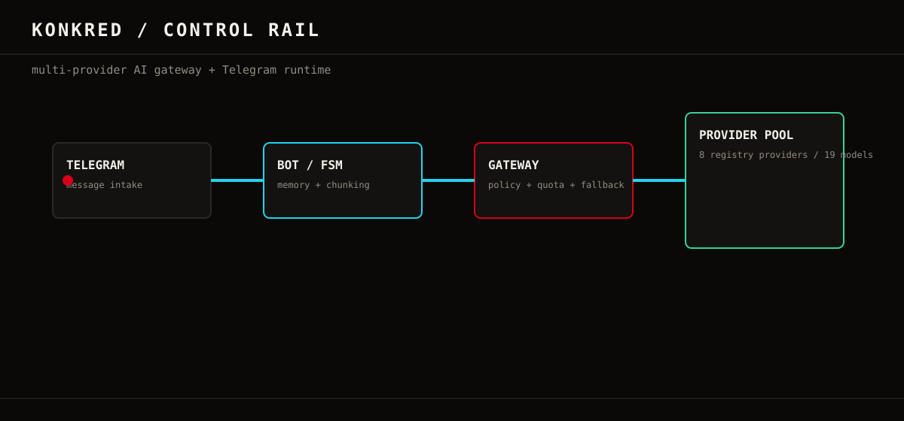

> [!IMPORTANT]
> The registry currently contains **8 providers including the offline `mock` simulator and 19 models**. Availability depends on configured credentials and upstream limits; the gateway reports live capacity through its health surfaces.

## System map

KONKRED is three runtime services: `bot` receives Telegram updates and owns the conversation UX; `gateway` exposes the controlled inference rail; `redis` stores conversation history and Aiogram FSM state. Provider adapters normalize upstream APIs behind the gateway policy engine.

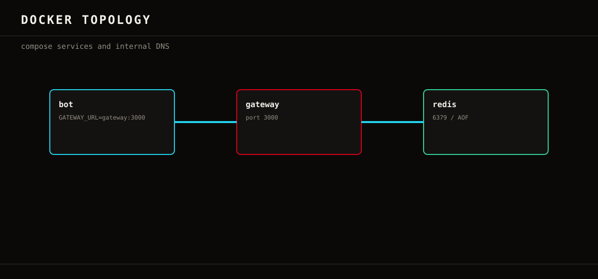

| Service | Runtime | Responsibility |
|---|---|---|
| `bot` | Python 3.11, Aiogram, httpx, redis | multi-turn handlers, FSM, retries, chunked Telegram replies |
| `gateway` | Node.js 20 ESM, zero runtime dependencies | auth, routing, quotas, fallback, cache, dedup, health |
| `redis` | Redis 7 with AOF | history and FSM state; Compose internal DNS service |

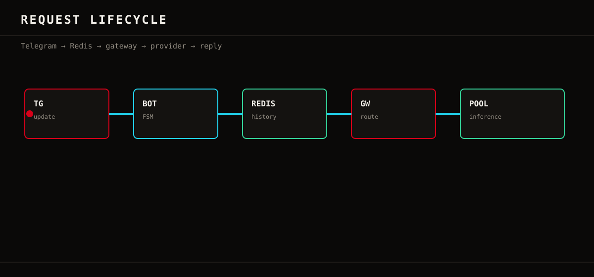

## Provider registry

The source of truth is [`gateway/data/policies.registry.json`](gateway/data/policies.registry.json). It defines provider reset policies, privacy metadata, optional learned rate-limit headers, model limits, context windows, quality, and verification dates. The adapters currently cover:

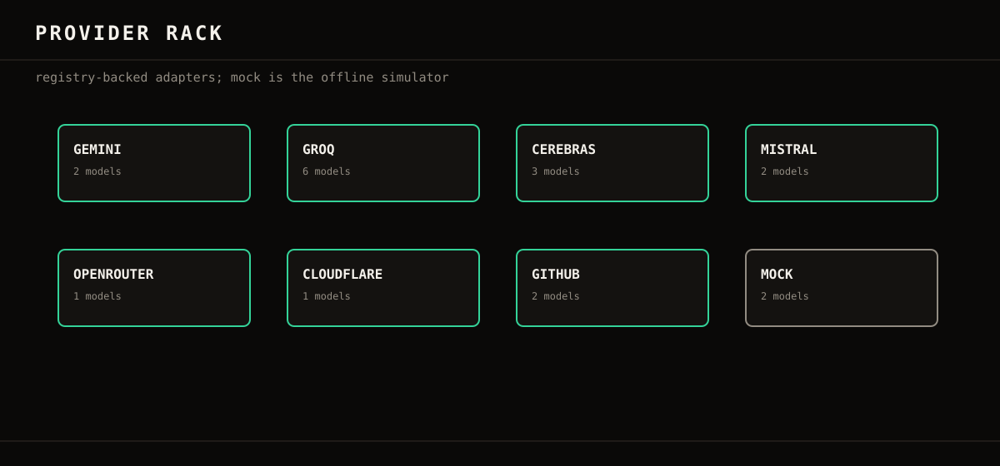

`gemini` · `groq` · `cerebras` · `mistral` · `openrouter` · `cloudflare` · `github` · `mock`

The `mock` adapter is intentionally an offline simulator for smoke tests and local development. It is not an upstream availability claim.

## Gateway contract

All responses use a stable envelope:

```json
{ "ok": true, "data": {} }
{ "ok": false, "error": { "code": "...", "message": "..." } }
```

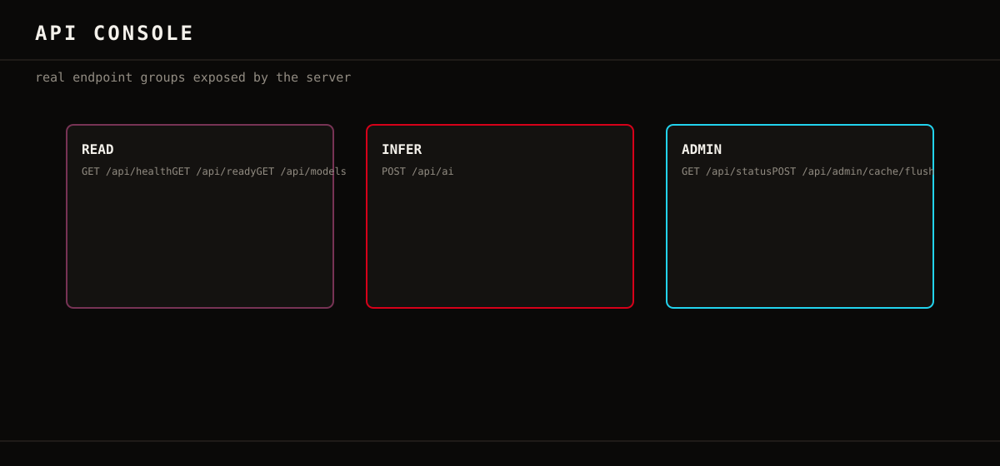

| Method | Endpoint | Authentication | Purpose |
|---|---|---|---|
| `POST` | `/api/ai` | `x-api-key` | inference, ranking and fallback |
| `GET` | `/api/health` | none | liveness and pool summary |
| `GET` | `/api/ready` | none | readiness; `503` when all usable keys are cooling |
| `GET` | `/api/models` | `x-api-key` | registry and current availability |
| `GET` | `/api/status` | `x-admin-key` | deep pool, cache and caller status |
| `POST` | `/api/admin/cache/flush` | `x-admin-key` | clear the bounded response cache |
| `GET` | `/` | none | HTML operator dashboard |

### Authentication headers

- `x-api-key` identifies a configured caller from `USERS_JSON`.
- `x-admin-key` protects deep status and cache administration.
- Provider secrets stay server-side in environment variables; they are never forwarded to Telegram users.
- The fullkonk streaming surface additionally recognizes `x-brain-key` / `FULLKONK_KEY` where enabled by the gateway.

### `POST /api/ai`

```json
{
  "taskType": "code-generation",
  "messages": [{"role":"user","content":"Write a chunker in Python"}],
  "maxTokens": 2048,
  "temperature": 0.3,
  "privacy": "private",
  "skipCache": false,
  "model": "groq:gpt-oss-120b"
}
```

`taskType` accepts `general`, `code-generation`, `bug-fixing`, `architecture`, `summarization`, `translate`, and `extraction`. `prompt` is accepted as a shorthand for one user message. The result includes `content`, `provider`, `model`, `modelId`, `usage`, `cached`, `deduplicated`, `attemptCount`, and `attempts[]`.

## Routing, quota and recovery

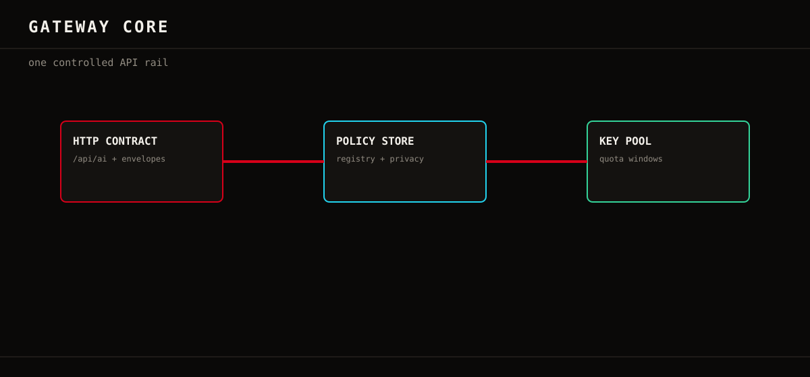

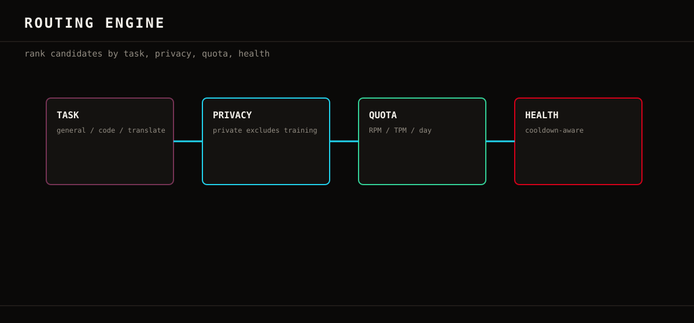

The router ranks registry models using task fit, requested privacy, model quality, key availability, quota headroom, and health. The key pool reserves estimated tokens before dispatch, commits actual usage after a response, and learns provider limits from declared headers when available.

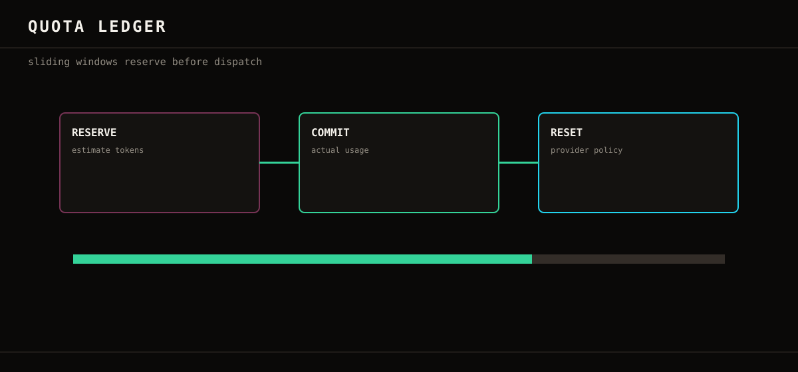

Failures are classified rather than blindly retried. Rate limits (`429`) honor upstream `Retry-After` and cool the key; auth failures (`401`/`403`) disable that credential for the configured auth cooldown; provider faults (`408`, `5xx`) move to another viable candidate; context overflow can trigger one trimmed retry. The fallback trace is returned to the caller.

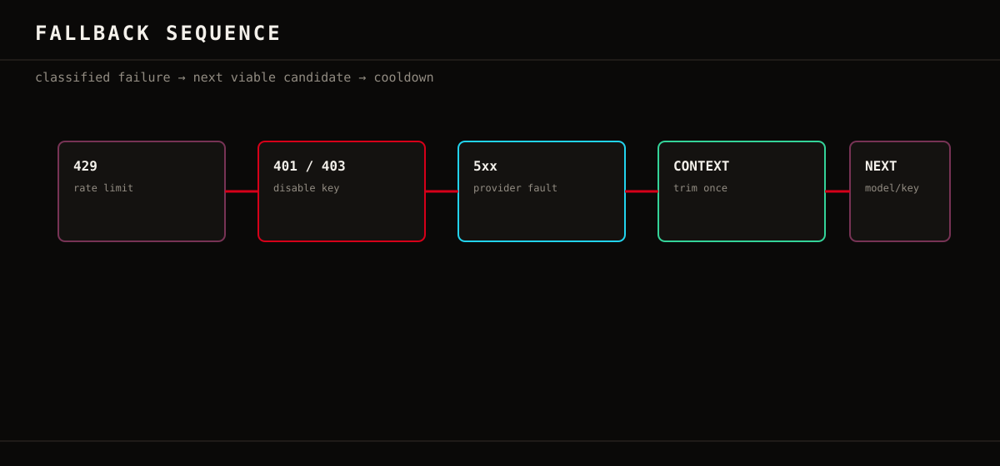

User rate limits (`USER_RPM`, `USER_RPD`, `USER_TPD`) return `429` with `Retry-After`. When no capacity remains, the gateway returns a capacity error and readiness becomes unavailable rather than claiming the pool is healthy.

## Cache and in-flight work

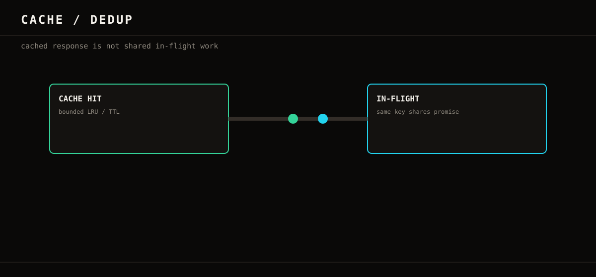

The bounded in-memory LRU cache keys normalized task, messages, generation settings, privacy, and preferred model. `CACHE_TTL_MS` and `CACHE_MAX_ENTRIES` bound retention. `skipCache` bypasses it. In-flight deduplication is a separate promise map: concurrent identical requests share one upstream operation and report `deduplicated: true`; it is not a cache hit.

## Telegram runtime

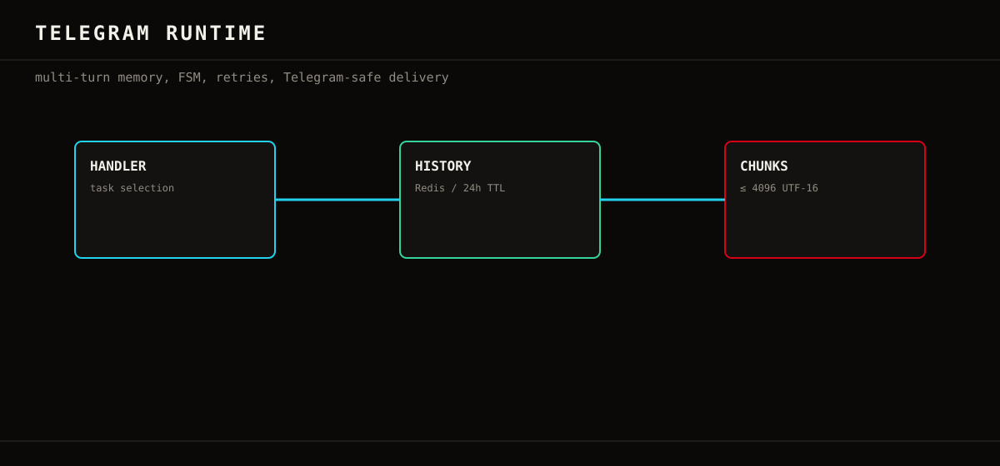

Handlers load history, task mode, and FSM state before calling the gateway. Redis outages degrade history to stateless operation instead of crashing the update. Successful turns are written with the configured TTL (24 hours by default). The gateway client retries cold-start and transient statuses with bounded backoff, honors `Retry-After`, and normalizes malformed responses into `GatewayError`.

Telegram replies are split at a configurable limit (default 3900), measured in UTF-16 units with Markdown fences re-balanced. This leaves headroom beneath Telegram's 4096-character hard limit. `/start`, task selection, reset/history controls and the handler flow live in [`bot/handlers.py`](bot/handlers.py).

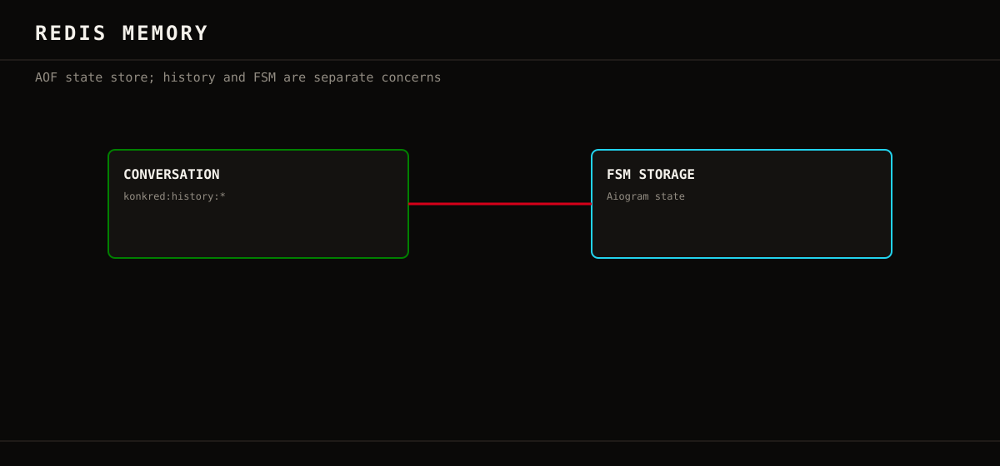

## Operations surfaces

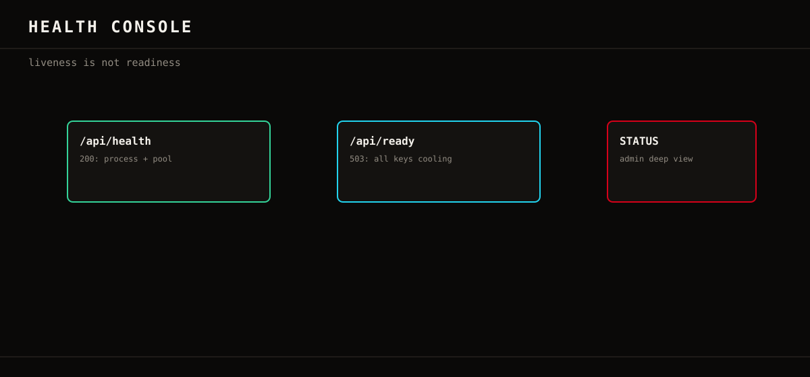

- `/api/health` answers whether the process is alive and summarizes the pool.
- `/api/ready` answers whether at least one usable route exists.
- `/api/status` is the authenticated operator view of providers, keys, callers, cache, dedup and registry counts.
- The HTML dashboard is enabled by `DASHBOARD_ENABLED` and exposes the same operational vocabulary without secrets.

## Configuration agreement

`.env.example` is checked against code by `scripts/validate_env.py`. Important groups include:

| Group | Variables |
|---|---|
| Runtime | `NODE_ENV`, `PORT`, `HOST`, `LOG_LEVEL`, `PARSE_MODE` |
| Caller/auth | `USERS_JSON`, `ADMIN_KEY`, `GATEWAY_API_KEY`, `ALLOWED_USER_IDS` |
| Providers | `GEMINI_KEY_P1..P3`, `GROQ_API_KEY`, `CEREBRAS_API_KEY`, `MISTRAL_API_KEY`, `OPENROUTER_API_KEY`, `CF_ACCOUNT_ID`, `CF_API_TOKEN`, `GITHUB_TOKEN` |
| Gateway policy | `USER_RPM`, `USER_RPD`, `USER_TPD`, `COOLDOWN_AFTER_RATE_LIMIT_MS`, `COOLDOWN_AFTER_AUTH_FAILURE_MS`, `CONTEXT_TRIM_RATIO` |
| Cache/dedup | `CACHE_ENABLED`, `CACHE_TTL_MS`, `CACHE_MAX_ENTRIES`, `DEDUP_ENABLED`, `DEDUP_TTL_MS` |
| Bot/Redis | `TELEGRAM_BOT_TOKEN`, `GATEWAY_URL`, `GATEWAY_HEALTH_URL`, `REDIS_URL`, `CHUNK_SIZE`, `HISTORY_MAX_TURNS`, `HISTORY_TTL_SECONDS`, `GATEWAY_MAX_RETRIES`, `STARTUP_WAIT_TIMEOUT` |

See [`.env.example`](.env.example) for defaults and the complete documented list. Do not put provider credentials in the repository.

## Run it

### Docker Compose

```bash
cp .env.example .env
# set TELEGRAM_BOT_TOKEN, USERS_JSON, GATEWAY_API_KEY and at least one provider key
./setup.sh --check
docker compose up -d --build
docker compose logs -f bot
curl -s http://localhost:3000/api/health | jq .
```

Offline gateway smoke mode needs no provider key:

```bash
DEMO_MOCK=true MOCK_FALLBACK=true node gateway/src/server.mjs
# or: (cd gateway && node scripts/smoke.mjs)
```

### Render / hosted Redis

[`render.yaml`](render.yaml) creates `konkred-gateway` as a Docker web service and `konkred-bot` as a Docker worker. Set the `sync: false` secrets in the Render dashboard. The bot points at the gateway's public `/api/ai` and `/api/health` URLs. Supply a RESP-compatible `REDIS_URL` such as an Upstash TLS URL; Render's managed Redis is not assumed by the blueprint. Deployment notes and alternative hosts are in [`DEPLOYMENT.md`](DEPLOYMENT.md).

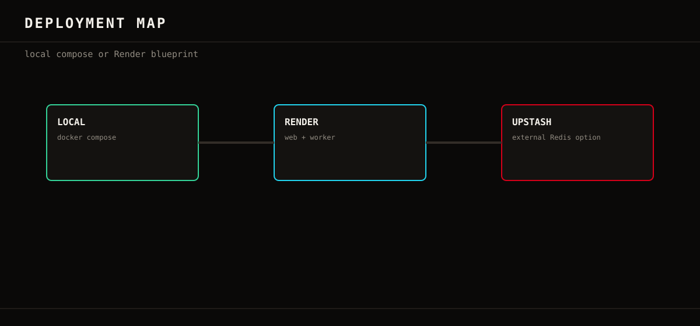

## Verification

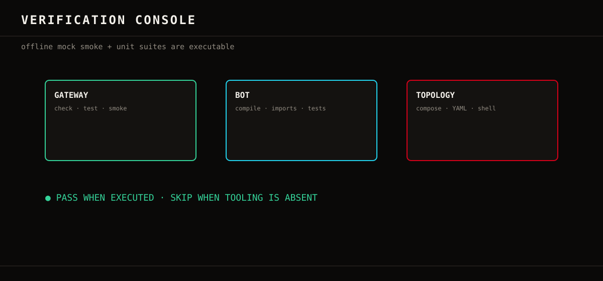

The repository's executable suite is [`scripts/verify.sh`](scripts/verify.sh). It checks Node syntax, gateway integrity/tests, Python compilation/import safety/tests, environment agreement, compose and YAML parsing, shell syntax, offline HTTP smoke, bot-to-gateway integration, asset generation/verification, and (when available) Docker builds. Run:

```bash
./scripts/verify.sh
python3 tools/readme/build_assets.py
python3 tools/readme/verify_assets.py
```

The CI workflow is [`ci/deploy.yml`](ci/deploy.yml) / [`.github/workflows/deploy.yml`](.github/workflows/deploy.yml). Results depend on installed tooling, provider credentials, Docker daemon access, and network availability; the verifier labels unavailable prerequisites as `SKIP`.

## Source map

- Gateway server and route surface: [`gateway/src/server.mjs`](gateway/src/server.mjs)
- Routing and recovery: [`gateway/src/gateway/`](gateway/src/gateway/)
- Provider adapters: [`gateway/src/providers/`](gateway/src/providers/)
- Telegram handlers and state: [`bot/handlers.py`](bot/handlers.py), [`bot/history.py`](bot/history.py), [`bot/chunking.py`](bot/chunking.py), [`bot/gateway_client.py`](bot/gateway_client.py)
- Deployment: [`docker-compose.yml`](docker-compose.yml), [`render.yaml`](render.yaml), [`DEPLOYMENT.md`](DEPLOYMENT.md)

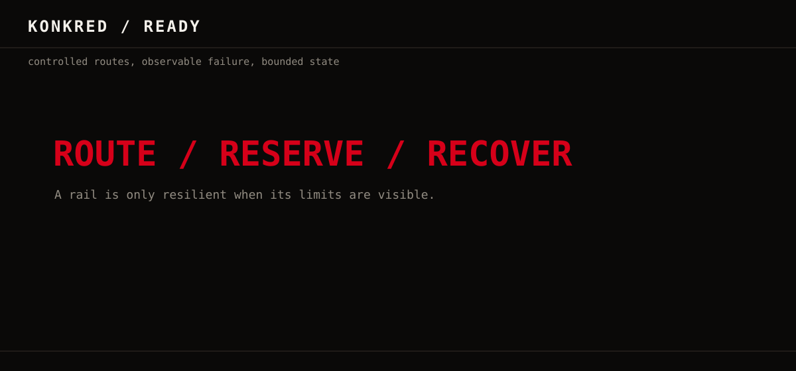

MIT licensed. Built as controlled infrastructure: route deliberately, reserve honestly, recover visibly.
